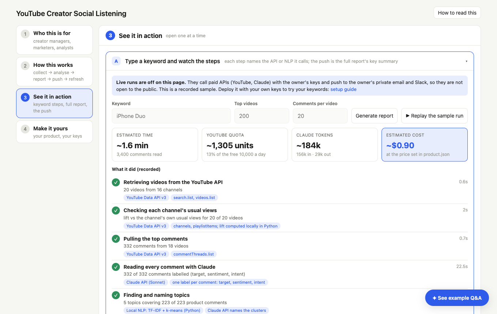
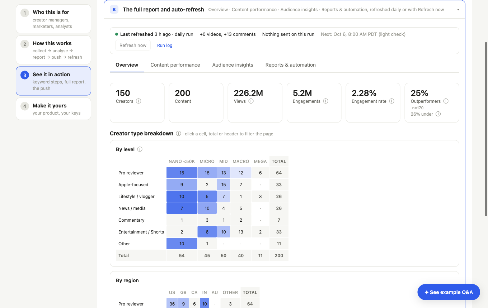
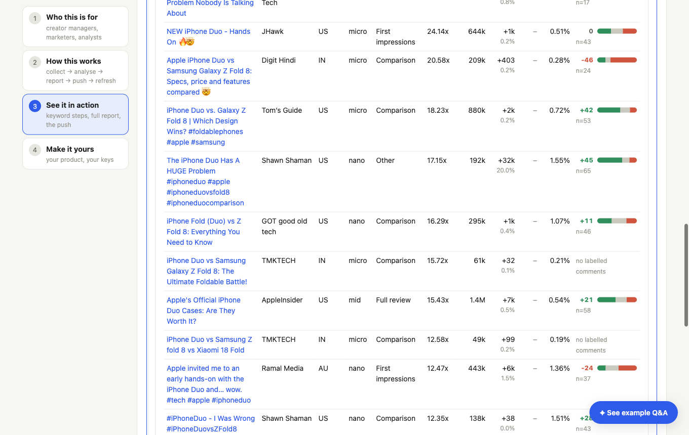
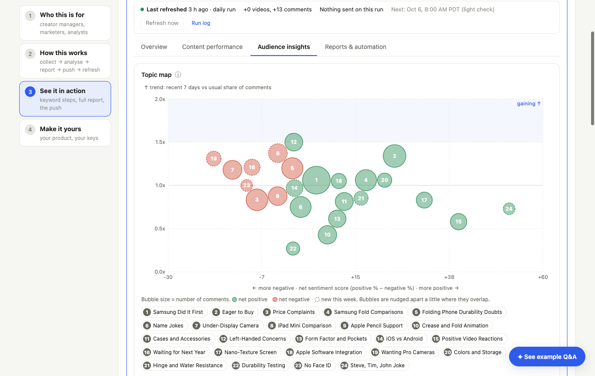
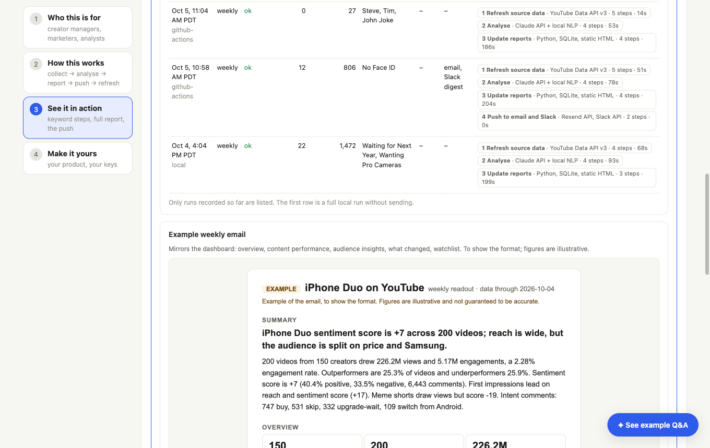

# 📡 YouTube Creator Social Listening

An AI workflow that listens to YouTube around a product launch and tells a marketing team which creators and content beat their own baseline, what the audience is saying, and what changed since yesterday. It refreshes itself every day and pushes the key summary to email and Slack, so nobody builds the report by hand.


[](https://github.com/allisonhanyuchen/youtube-creator-social-listening/actions/workflows/tests.yml)

**[🚀 Live demo → youtube-creator-social-listening.vercel.app](https://youtube-creator-social-listening.vercel.app/)** (the case is Apple's iPhone Duo launch; the public page shows no comment text)

---

## 👥 Who This Is For

| Who | What they get |
|---|---|
| **Creator and influencer managers** | Which creators and content formats beat their own baseline, at which channel level and region, and what the audience says about them |
| **Launch and brand marketers** | How a new product is landing on YouTube: sentiment, what people talk about, how competitors compare, what changed since yesterday |
| **Analysts and agencies** | A repeatable readout in the dashboard, email and Slack, without reading thousands of comments or maintaining spreadsheets |

---

## ⚙️ How This Works

| Step | What happens | Tech |
|---|---|---|
| 1 **Collect** | The top videos under the keywords you type and the top comments under each video | YouTube Data API v3 |
| 2 **Analyse** | Python computes every number locally so it can be checked: lift against each channel's own baseline, views gained, trends. Claude reads each comment (who it is about, sentiment, intent) and names the topics that local clustering finds | Claude API, Python, SQLite |
| 3 **Report** | An interactive dashboard with Overview, Content performance and Audience insights, plus an Ask-the-data chat that answers with read-only SQL | Interactive HTML page, Vercel |
| 4 **Push** | The full report's key summary goes to email and Slack, with alerts when something shifts | Resend, Slack |
| 5 **Refresh** | The whole run repeats every day; each run is logged with its tokens, quota units and cost | GitHub Actions |

**APIs it calls**

| API | What it does here |
|------|---------|
| YouTube Data API v3 | Videos, channel stats, comments, daily view snapshots |
| Claude API (Sonnet) | Per-comment labels, topic names, the written summary, text-to-SQL for Ask-the-data |
| Resend API | Sends the email report |
| Slack Incoming Webhook API | Posts the digest and alerts to a channel |
| Slack Events API (Socket Mode, optional) | The @-mentionable Q&A agent |
| GitHub Actions workflow dispatch API | Starts a run from the page and follows its stages |

It runs on Python (standard library) with SQLite, TF-IDF and k-means clustering for topics, GitHub Actions for the daily run, and Vercel for the page and its serverless functions.

**What you get**

- 🔍 A keyword box on the page: choose the keyword, how many top videos and how many comments per video, and see the estimated time, YouTube quota and Claude cost before you run it
- 📈 Creator performance as lift (views against the channel's own usual views) next to a net sentiment score (positive minus negative), never merged into one number
- 🗺️ A topic map by sentiment and trend; new topics are discovered on every refresh
- 🔒 Public by design: no comment text published, paid API calls behind a demo code

---

## 🖥️ Demo

**Input → output → push and update**

**1. Input.** Type the keywords, how many top videos and how many comments per video. The page shows the estimated time, YouTube quota and Claude cost, then runs each step and names the API or NLP it calls:



**2. Output.** The report: Overview, Content performance, Audience insights.







**3. Push and update.** The same key summary goes to email and Slack, and the run log records every daily refresh with its cost:



---

## 🚀 Make It Yours

Bring your own API keys and deploy. You set what to listen to in the app itself, not in a file. The full click-by-click guide for every key is in **[guides/SETUP.md](guides/SETUP.md)**.

1. **Fork** the repo and add five keys as repository secrets: `YOUTUBE_API_KEY`, `ANTHROPIC_API_KEY`, `SLACK_WEBHOOK_URL`, `RESEND_API_KEY`, `REPORT_EMAIL_TO`
2. **Publish the page** on Vercel and add the same keys, an access code of your choice (`DEMO_CODE`) and a `GITHUB_TOKEN` (Actions and Contents, read and write, this repo only)
3. **Open your page and type your input**: the keywords, how many top videos per keyword, how many comments per video. Press **Run**: it saves them as the app's input, runs the pipeline on GitHub Actions (collect, analyse, report, push), shows the report and pushes the key summary to your email and Slack
4. **That is all**: the saved input is repeated every day at 15:00 UTC; change it in the page any time (new keywords for another product start from scratch)

The deployed page is the clean app: input, run, report, push. The sidebar, recorded sample, Quick preview, example email and Slack previews and explanations on the public demo are extras for demonstration (they appear when `"demo": true` in `input.json`).

Run it on your computer: `python3 src/serve.py` and open http://127.0.0.1:8770.

---

## 📁 Project Structure

```
├── src/                 all the code (run any script as python3 src/<name>.py)
│   ├── collect.py classify.py relevance.py comments.py snapshots.py performance.py   collect and label
│   ├── db.py topics.py textcluster.py insights.py                                    analyse
│   ├── report.py notify.py build_dashboard.py                                        email, Slack, the page
│   ├── run_weekly.py explore.py ask.py serve.py slack_bot.py                         the runner, keyword runs, Q&A
│   └── dashboard.tmpl.html                                                           the page template
├── api/                 Vercel functions: live chat, demo-code gated runs and refresh
├── state/               committed, text-free data so every run is incremental
├── docs/                the public page (rebuilt by every run)
├── guides/              SETUP.md (keys, deploy) and METRICS.md (definitions, limits, privacy)
├── screenshots/         images used in this README
├── tests/               unit tests, standard library only
├── input.json         your inputs: keywords, top videos, comments per video, and the product
└── .github/workflows/   refresh.yml (daily run), tests.yml
```

---

## 📊 Cost and Limits

| Item | Value |
|------|-------|
| YouTube free quota | 10,000 units a day; a search costs 100 |
| Keyword run, 20 videos x 20 comments | about 180 units, 17k input and 4k output Claude tokens, roughly 0.1 USD, about 20 seconds (measured) |
| Keyword run, 200 videos x 20 comments | estimated 1,300 units, about 1 USD, under 2 minutes |
| Daily refresh (steady state) | a few hundred new comments, about 0.1 USD |
| First full run | about 19,000 comments, a few dollars |

Prices use `pricing` in `input.json` (default 3 and 15 USD per million input and output tokens, a Sonnet-class assumption: set your own). Accessories, other products that share the name, and unrelated videos are checked and left out of the numbers. Definitions of every metric, data limits and the privacy design are in **[guides/METRICS.md](guides/METRICS.md)**.
